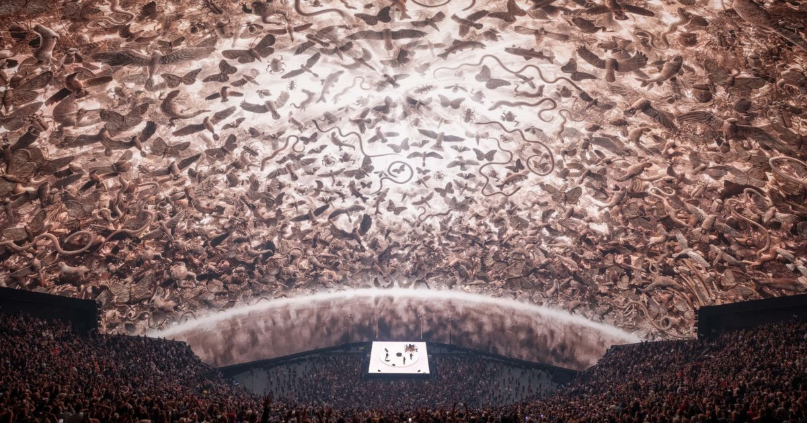
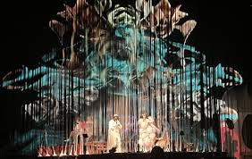

# MD-Masters-Thesis

 # Inspiration 

# I/List of terms/words of my topic
- Concert
- Visual
- Mapping 
- Vdjing (Visual Jockeying)
- Lights
- Spectacular
- Screen
- scene effect
- Live Performance
- Audiovisual Performance
- Stage Design
- Visual Identity
- Music and Visual Art
- Visual Storytelling
- Audience Experience
- Immersive Environments
- Media Mapping
- Digital Scenography
- Stage Projections
- Sensory Design
- Synesthesia in Art
- Real-time Visuals
- Live Music Experience
- Visual Language
- Performance Art
- Intermediality

# II/ Questions research
Why are concert visuals not always consistently linked to the artist’s identity? Why do they sometimes vary within the same set?
What were the first live performances to integrate visuals into concerts?
How do visuals contribute to the audience’s experience of a concert?
In what ways do concert visuals add meaning or reinterpret the live music performance?
How and why did concerts, originally focused solely on live music listening, evolve into multi-sensory, audiovisual experiences?

# III/ Academic resources
1/ Magazine Rolling Sto
2/ Du son aux espace, environnement, paysage, milieu,
ambiance… sonores
Makis Solomos

3/ Spectacular ; Stage Design ; Concerts, Events & Ceremonies, Theaters
Auteur Collectif

4/ LSI

5/ FoH Online

6/ L-ISA

7/ Écrans, médiations et authenticité dans le concert pop : deux cas d’étude Par Giulia Sarno

8/
9/
10/

# IV/ Visual about my topic

